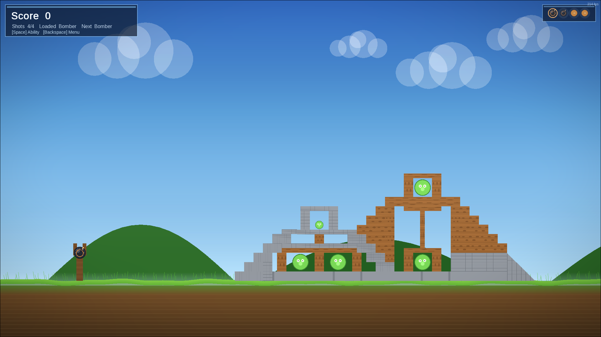
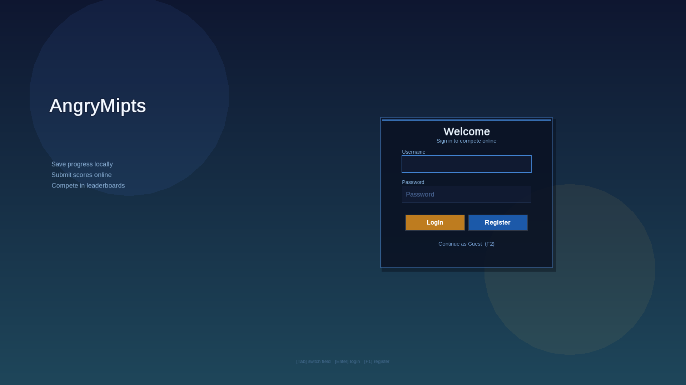
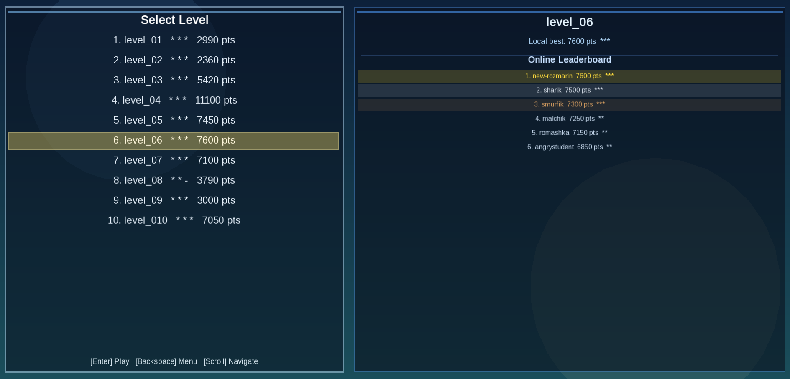
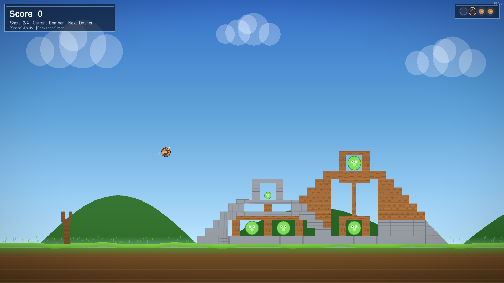
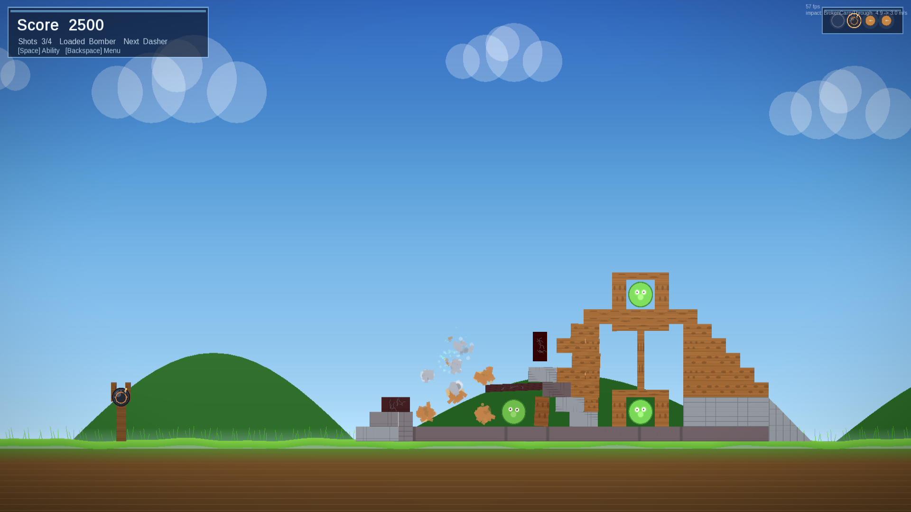
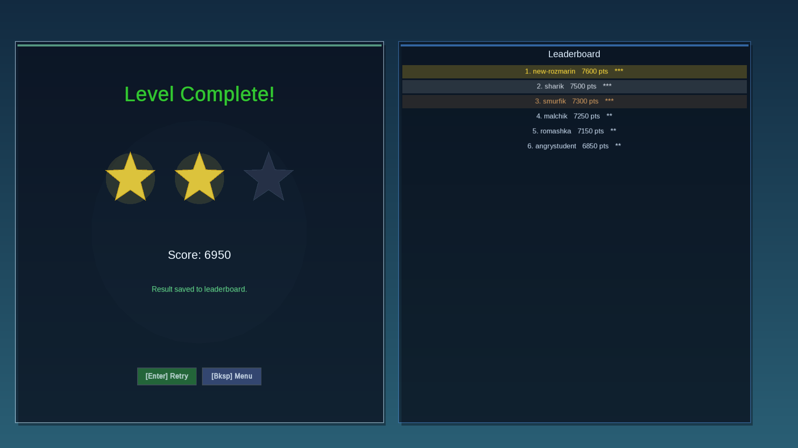
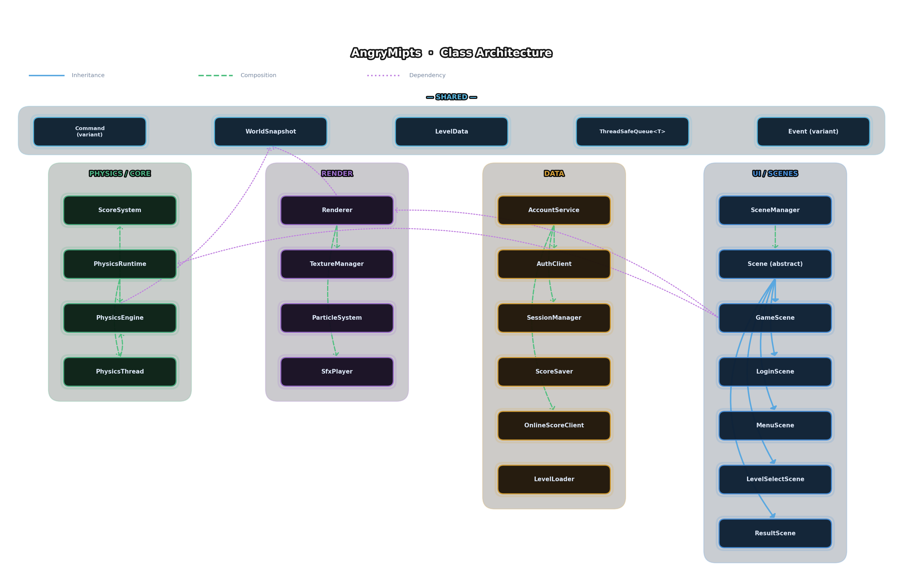

# AngryMipts

<div align="center">


[](LICENSE)

</div>



---

## Overview

**AngryMipts** is a physics-based projectile game inspired by the Angry Birds genre, built from scratch in C++17 as a university course project. Players use a slingshot to launch a variety of projectiles at structures made from four distinct materials, aiming to defeat all targets within a limited number of shots to earn up to three stars.

The project is technically non-trivial: the physics simulation runs on a dedicated worker thread at a fixed 60 Hz timestep, fully decoupled from rendering via a double-buffered **WorldSnapshot** with atomic index swapping. Communication between threads is handled exclusively through two lock-free `ThreadSafeQueue<T>` channels — one for **Commands** (UI -> Physics) and one for **Events** (Physics -> UI) — eliminating shared mutable state and making the architecture safe by construction.

The codebase targets two completely different runtimes — native desktop via **SFML 3** and browser via **Emscripten + Raylib 5.5** — through a unified platform abstraction layer (`platform/`) that provides a common API for windowing, rendering primitives, input, and HTTP. All online features (registration, login, score submission, per-level leaderboards) work on both platforms with JWT-based authentication and async fetch semantics.

---

## Features

### Gameplay

- **9 projectile types** with unique special abilities activated mid-flight
- **4 destructible block materials**: Wood, Stone, Glass, Ice — each with distinct durability
- **3 block shapes**: Rect, Circle, Triangle (triangle geometry driven by exact vertex data from the snapshot)
- **?? hand-crafted levels** in JSON format; level 05 is a showcase of all projectile types
- **3-star scoring** per level based on score thresholds defined in level metadata
- **Slingshot drag mechanics** with pull-vector physics
- **Online leaderboard** per level with JWT-authenticated score submission

### Technical

- Multithreaded physics at fixed 60 Hz, rendered asynchronously from the main thread
- Double-buffered `WorldSnapshot` — render reads one buffer while physics writes the other
- `ThreadSafeQueue<Command>` (non-blocking `try_pop`) and `ThreadSafeQueue<Event>` (`drain_events`) for zero-coupling inter-thread communication
- **Command pattern** for all game actions (launch, restart, load level, pause, activate ability)
- **Observer/Event variant** for physics outcomes (8 event types covering collisions, destruction, scoring, and level state)
- **Strategy pattern** for physics execution mode: `PhysicsMode::SingleThread` or `Threaded`
- **Snapshot pattern** with atomic double-buffering for safe cross-thread state transfer
- **Facade pattern** over `PhysicsRuntime` and `AccountService` to hide subsystem complexity
- **Template Method** via `Scene` abstract base class governing all scene lifecycle
- Cross-platform rendering abstraction covering SFML 3 (native) and Raylib 5.5 (web/Emscripten)
- Unified HTTP abstraction: CPR on native, `emscripten_fetch` on web
- `AuthClient` + `SessionManager` with persistent `session.json` token storage
- Async leaderboard fetching with four distinct status codes
- 6 GTest modules covering physics, auth, account, scores, sessions, and UI/render
- CI/CD via GitHub Actions: self-hosted Linux runner, ccache, CTest, GitHub Pages deployment

---

## Screenshots

**Main / Login**



**Level Select**



**Mid-Gameplay**



**Destruction Moment**



**Result Screen**



---

## Architecture

### Module Map

```
┌─────────────────────────────────────────────────────────────────────┐
│                         src/                                        │
│                                                                     │
│  ┌──────────┐   ┌──────────┐   ┌──────────┐   ┌──────────────────┐  │
│  │ shared/  │   │ physics/ │   │  core/   │   │     data/        │  │
│  │          │   │          │   │          │   │                  │  │
│  │ types    │◄──│ engine   │   │ score    │   │ LevelLoader      │  │
│  │ events   │   │ thread   │   │ system   │   │ AuthClient       │  │
│  │ commands │   │ runtime  │   │          │   │ SessionManager   │  │
│  │ snapshot │   │ units    │   │          │   │ OnlineScore      │  │
│  │ config   │   │          │   │          │   │   Client         │  │
│  └────┬─────┘   └────┬─────┘   └──────────┘   │ AccountService   │  │
│       │              │                        │ ScoreSaver       │  │
│       │         ┌────▼─────┐                  └──────────────────┘  │
│       │         │platform/ │                                        │
│       │         │          │                                        │
│       │         │ SFML     │                                        │
│       │         │ Raylib   │                                        │
│       │         │ HTTP     │                                        │
│       │         └────┬─────┘                                        │
│       │              │                                              │
│  ┌────▼──────────────▼──────────────────────────────────────────┐   │
│  │                         ui/                                  │   │
│  │                                                              │   │
│  │  SceneManager -> [LoginScene, MenuScene, LevelSelectScene,   │   │
│  │                   GameScene, ResultScene]                    │   │
│  │  Slingshot                                                   │   │
│  └──────────────────────────────────────────────────────────────┘   │
│                                                                     │
│  ┌─────────────────────────────────────────────────────────────┐    │
│  │                       render/                               │    │
│  │  Renderer  TextureManager  ParticleSystem  SfxPlayer        │    │
│  └─────────────────────────────────────────────────────────────┘    │
└─────────────────────────────────────────────────────────────────────┘
```

### Inter-Thread Data Flow

```
╔══════════════════════════╗          ╔══════════════════════════╗
║       MAIN THREAD        ║          ║     PHYSICS THREAD       ║
║  (UI · Events · Render)  ║          ║  worker_loop()  60 Hz    ║
╠══════════════════════════╣          ╠══════════════════════════╣
║                          ║          ║                          ║
║  SceneManager            ║          ║  PhysicsEngine           ║
║  Slingshot input         ║   push   ║  Box2D world step        ║
║  ──────────────────►  ThreadSafeQueue<Command>  ──────────►    ║
║                          ║ try_pop  ║  LaunchCmd               ║
║                          ║          ║  RestartCmd              ║
║                          ║          ║  LoadLevelCmd            ║
║                          ║          ║  PauseCmd                ║
║                          ║          ║  ActivateAbilityCmd      ║
║                          ║          ║                          ║
║  drain_events()  ◄──  ThreadSafeQueue<Event>  ◄──────────────  ║
║  Scene::on_event()       ║          ║  CollisionEvent          ║
║  ScoreSystem             ║          ║  DestroyedEvent          ║
║  UI state update         ║          ║  TargetHitEvent          ║
║                          ║          ║  ScoreChangedEvent       ║
║                          ║          ║  LevelCompletedEvent     ║
║                          ║          ║  ProjectileReadyEvent    ║
║                          ║          ║  AbilityActivatedEvent   ║
║                          ║          ║  ImpactResolvedEvent     ║
║                          ║          ║                          ║
║  Renderer::draw()  ◄──────────── WorldSnapshot (double buffer) ║
║  reads front buffer      ║  atomic  ║  writes back buffer,     ║
║  (lock-free read path)   ║  swap    ║  then swaps index        ║
╚══════════════════════════╝          ╚══════════════════════════╝
```

### Design Patterns

|   Pattern   |                         Implementation                                      |                               Purpose                                    |
|-------------|-----------------------------------------------------------------------------|--------------------------------------------------------------------------|
| **Command** | `LaunchCmd`, `RestartCmd`, `LoadLevelCmd`, `PauseCmd`, `ActivateAbilityCmd` | Encapsulate game actions as data; safely cross thread boundary via queue |
| **Observer / Event Variant** | `CollisionEvent`, `DestroyedEvent`, `TargetHitEvent`, `ScoreChangedEvent`, `LevelCompletedEvent`, `ProjectileReadyEvent`, `AbilityActivatedEvent`, `ImpactResolvedEvent` | Physics thread publishes events; main thread reacts without polling |
| **Snapshot** | `WorldSnapshot`, double-buffered with `std::atomic<int> front_snapshot_index_` | Provide renderer with a consistent, immutable world state without stalling the physics thread |
| **Strategy** | `PhysicsMode::SingleThread` vs `PhysicsMode::Threaded` | Allow physics to run on the main thread (debug/Web) or a dedicated worker (native) without changing call sites |
| **Facade** | `PhysicsRuntime`, `AccountService` | Simplify access to multi-class subsystems (physics engine + thread + queues; auth + session + online score) |
| **Template Method** | `Scene` abstract base class -> `GameScene`, `MenuScene`, `LoginScene`, `LevelSelectScene`, `ResultScene` | Define scene lifecycle hooks (init, update, render, on_event) enforced by the abstract base |

---

## Class Hierarchy

### Inheritance Graph



### Key Class Responsibilities

| Class | Module | Responsibility | Key Dependencies |
|---|---|---|---|
| `Scene` | `ui/` | Abstract base; defines scene lifecycle via Template Method | `SceneManager`, platform event types |
| `GameScene` | `ui/` | Active gameplay: slingshot input, HUD, physics dispatch | `Slingshot`, `PhysicsRuntime`, `ScoreSystem`, `Renderer` |
| `MenuScene` | `ui/` | Main menu navigation | `SceneManager` |
| `LoginScene` | `ui/` | Login / register form and validation | `AccountService` |
| `LevelSelectScene` | `ui/` | Level grid, star display, leaderboard panel | `LevelLoader`, `OnlineScoreClient`, `ScoreSystem` |
| `ResultScene` | `ui/` | End-of-level result, star animation | `ScoreSystem`, `SceneManager` |
| `SceneManager` | `ui/` | Owns and transitions between `Scene` instances by `SceneId` | All `Scene` subclasses |
| `PhysicsEngine` | `physics/` | Box2D world, body creation, step, event generation | Box2D 3.0.0 |
| `PhysicsThread` | `physics/` | Spawns worker thread, runs `worker_loop()` at 60 Hz | `PhysicsEngine`, `std::condition_variable stop_cv_` |
| `PhysicsRuntime` | `physics/` | Facade over engine + thread + queues + snapshot | `PhysicsEngine`, `PhysicsThread`, `ThreadSafeQueue<Command>`, `ThreadSafeQueue<Event>`, `WorldSnapshot` |
| `WorldSnapshot` | `shared/` | Immutable copy of world state for renderer; double-buffered | `std::array<WorldSnapshot, 2>`, `std::atomic<int>`, `std::mutex` |
| `ThreadSafeQueue<T>` | `shared/` | Thread-safe FIFO using mutex + condition variable | `std::mutex`, `std::queue<T>` |
| `Renderer` | `render/` | Draws world from `WorldSnapshot`; manages views | `TextureManager`, `WorldSnapshot` |
| `TextureManager` | `render/` | Loads and caches platform textures | Platform texture type |
| `ParticleSystem` | `render/` | Spawns and simulates visual particle effects | Platform render target |
| `SfxPlayer` | `render/` | Plays sound effects keyed to game events | Platform audio |
| `LevelLoader` | `data/` | Parses level JSON files into level data structures | `nlohmann_json` |
| `AuthClient` | `data/` | HTTP calls to `/register` and `/login`; parses `AuthResult` | `platform/http.hpp` |
| `SessionManager` | `data/` | Saves/loads `session.json` with token and username | Filesystem |
| `OnlineScoreClient` | `data/` | Submits scores (POST `/scores`) and fetches leaderboards (GET `/leaderboards/{levelId}`) | `platform/http.hpp`, JWT token |
| `AccountService` | `data/` | Facade: session bootstrap, login, logout, coordinating auth + session + online score | `AuthClient`, `SessionManager`, `OnlineScoreClient` |
| `ScoreSaver` | `data/` | Persists local best scores | Filesystem |
| `ScoreSystem` | `core/` | Tracks current run score, computes star rating | `LevelMeta` thresholds |
| `Slingshot` | `ui/` | Captures drag input, computes pull vector, emits `LaunchCmd` | Platform input events |
| `Logger` | `shared/` | Structured logging with file/line context | — |

---

## Multithreading

### Thread Architecture

```
 ┌─────────────────────────────────────────────────────────────────┐
 │ OS Process                                                      │
 │                                                                 │
 │  Thread 0: MAIN                    Thread 1: PHYSICS WORKER     │
 │  ─────────────────                 ───────────────────────────  │
 │  Window event loop                 worker_loop()                │
 │  Scene::update(dt)                 Fixed timestep: 1/60 s       │
 │  Renderer::draw()                  PhysicsEngine::step()        │
 │  Input handling                    Box2D world integration      │
 │  HTTP callbacks                    Collision detection          │
 │  drain_events()  ◄───────────────► push_event()                 │
 │  push_command()  ───────────────►  try_pop()                    │
 │                   ThreadSafeQueue  snapshot swap (atomic)       │
 │                                                                 │
 │  Synchronisation primitives used:                               │
 │  • std::mutex (snapshot_mutex_, queue internal)                 │
 │  • std::atomic<int> front_snapshot_index_                       │
 │  • std::condition_variable stop_cv_  (graceful shutdown)        │
 └─────────────────────────────────────────────────────────────────┘
```

### Synchronisation Details

**Command queue (Main -> Physics)**

`ThreadSafeQueue<Command>` uses an internal `std::mutex` and `std::queue<T>`. The main thread calls `push()` (blocking only for the duration of the lock), and the physics thread calls `try_pop()` at the start of each tick — a non-blocking poll that returns immediately if the queue is empty. This means the physics loop never waits on the UI thread.

**Event queue (Physics -> Main)**

The physics thread calls `push()` for each event generated during a step. After its own frame processing the main thread calls `drain_events()`, which atomically moves all queued events into a local vector and releases the lock before dispatching — preventing re-entrant lock acquisition during event callbacks.

**WorldSnapshot double-buffer**

```
 back buffer (index 1-front)          front buffer (index front)
 ───────────────────────────          ──────────────────────────
 Physics thread writes here           Renderer reads here
 during each step                     without any lock

 After writing:
   snapshot_mutex_.lock()
   front_snapshot_index_ ^= 1   <- atomic swap
   snapshot_mutex_.unlock()

 Renderer:
   idx = front_snapshot_index_.load(std::memory_order_acquire)
   const WorldSnapshot& snap = snapshots_[idx]   <- no lock needed
```

The snapshot write requires only a brief mutex lock to swap the atomic index. The renderer uses `memory_order_acquire` on the load, guaranteeing it sees all stores the physics thread performed before the swap. As a result, rendering is **never blocked** by physics computation and the renderer always sees a complete, consistent state.

**Shutdown**

`PhysicsThread` uses `std::condition_variable stop_cv_` to sleep between ticks without busy-waiting. Setting a stop flag and calling `stop_cv_.notify_all()` causes the worker to exit its loop and the owning thread to `join()` cleanly.

---

## Gameplay Mechanics

### Projectile Types

| # | Type | Special Ability (ActivateAbilityCmd) |
|---|---|---|
| 1 | **Standard** | No ability; baseline damage and trajectory |
| 2 | **Heavy** | No ability; high mass, high impulse on impact |
| 3 | **Splitter** | Splits into multiple smaller projectiles on activation |
| 4 | **Dasher** | Accelerates forward with a burst of speed on activation |
| 5 | **Bomber** | Detonates an explosion on activation, applying radial impulse |
| 6 | **Dropper** | Drops a secondary projectile downward on activation |
| 7 | **Boomerang** | Curves back toward the slingshot on activation |
| 8 | **Bubbler** | Expands a bubble on activation, pushing surrounding objects |
| 9 | **Inflater** | Inflates in size on activation, increasing area and mass |

### Block Materials

| Material | Relative Durability | Notes |
|---|---|---|
| **Wood** | Medium | Balanced general-purpose structure material |
| **Stone** | High | Resistant to most projectiles; requires heavy hits |
| **Glass** | Low | Shatters easily; useful for creating cascading collapses |
| **Ice** | Low-Medium | Brittle under impact; slippery surface behavior |

### Scoring & Stars

Each level defines star thresholds in its metadata:

```json
"star_1_threshold": 1000,
"star_2_threshold": 3000,
"star_3_threshold": 6000
```

`ScoreSystem` accumulates score from `TargetHitEvent.scoreAwarded` and `ScoreChangedEvent.newScore`. `LevelCompletedEvent` carries `{ win, finalScore, stars }`. Stars are determined by comparing `finalScore` against the three thresholds.

Unused shots grant bonus points at level completion. `ImpactResolvedEvent` provides per-collision telemetry (`outcome`, `speedBeforeMps`, `speedAfterMps`) that the physics engine uses to compute partial-damage scoring.

### Slingshot Mechanics

`Slingshot` captures pointer/mouse press, drag, and release events. It computes a pull vector in screen pixels (`pullVectorPx`) relative to the slingshot pivot. On release it emits `LaunchCmd { pullVectorPx }`. The physics engine converts screen pixels to Box2D metres using `kPixelsPerMeter = 50` and applies the corresponding impulse to the loaded projectile body.

---

## Level Format

### JSON Example

```json
{
  "id": "level_01",
  "name": "Tutorial",
  "totalShots": 3,
  "star_1_threshold": 500,
  "star_2_threshold": 1500,
  "star_3_threshold": 3000,
  "projectiles": ["Standard", "Standard", "Heavy"],
  "blocks": [
    {
      "shape": "Rect",
      "material": "Wood",
      "x": 900, "y": 540,
      "width": 40, "height": 80
    },
    {
      "shape": "Triangle",
      "material": "Stone",
      "vertices": [[0, -40], [30, 20], [-30, 20]],
      "x": 960, "y": 510
    }
  ],
  "targets": [
    { "id": 1, "x": 920, "y": 480, "scoreAwarded": 500 }
  ]
}
```

### Level Fields

| Field | Type | Description |
|---|---|---|
| `id` | `string` | Unique level identifier (e.g. `"level_01"`) |
| `name` | `string` | Human-readable level name |
| `totalShots` | `int` | Number of projectiles the player has |
| `star_1_threshold` | `int` | Minimum score for 1 star |
| `star_2_threshold` | `int` | Minimum score for 2 stars |
| `star_3_threshold` | `int` | Minimum score for 3 stars |
| `projectiles` | `string[]` | Ordered list of projectile types |
| `blocks[].shape` | `string` | `"Rect"`, `"Circle"`, or `"Triangle"` |
| `blocks[].material` | `string` | `"Wood"`, `"Stone"`, `"Glass"`, or `"Ice"` |
| `blocks[].vertices` | `[x,y][]` | Vertex list for Triangle shape (pixel coords, relative to block origin) |
| `targets[].id` | `int` | Body identifier for event correlation |
| `targets[].scoreAwarded` | `int` | Points granted on `TargetHitEvent` |

Levels are stored in `levels/level_01.json` through `levels/level_0113.json` (18 levels total). The largest level is `level_0113.json` (12.9 KB). Level 05 is a developer showcase containing all 9 projectile types.

### Level Authoring Tool

`tools/tiled_to_level.py` converts a **Tiled** map export (`.tmj` format) to the gameplay JSON format above. This allows level designers to place blocks and targets visually in Tiled and export directly to the game's format.

---

## Online System

### Authentication Flow

```
  Client                              Backend
  ──────                              ───────
  POST /register ──────────────────►
    { username, password }
                       ◄─────────────
                         AuthResult { token, username, errorMessage }


  POST /login ─────────────────────►
    { username, password }
                       ◄─────────────
                         AuthResult { token, username, errorMessage }


  SessionManager.save() ──► session.json { token, username }


  POST /scores ────────────────────►
    Authorization: Bearer <token>
    { levelId, score, stars }
                       ◄─────────────
                         HTTP 200 OK


  GET /leaderboards/{levelId} ─────►
                       ◄─────────────
                         LeaderboardFetchResult {
                           status: Ok | Empty | Unavailable | InvalidResponse
                           entries: [ { playerName, score, stars } ]
                         }
```

### Session Persistence

`SessionManager` writes `session.json` to disk after a successful login. On the next application launch, `AccountService::bootstrap()` reads this file to restore the session without requiring the user to log in again. `SessionManager::logout()` deletes the file.

### Leaderboard Status Codes

| `LeaderboardFetchStatus` | Meaning |
|---|---|
| `Ok` | Entries retrieved successfully |
| `Empty` | Level has no recorded scores yet |
| `Unavailable` | Server unreachable or HTTP error |
| `InvalidResponse` | Response body failed JSON parsing |

### Async Operations

Score submission and leaderboard fetching use async variants:

- `submit_score_with_token_async` — fire-and-forget; result handled via callback
- `fetch_leaderboard_with_status_async` — callback delivers `LeaderboardFetchResult`

On native, these run via CPR's async API. On web, `emscripten_fetch` provides non-blocking XHR. Both paths use the unified `platform/http.hpp` `Response { status_code, body, network_error, error_message }` type.

---

## Platform Support

### Target Platforms

| Feature | Native (Linux / macOS) | Web (Emscripten) |
|---|---|---|
| Rendering library | SFML 3 | Raylib 5.5 |
| HTTP client | CPR 1.10.4 | `emscripten_fetch` |
| Physics mode default | `Threaded` | `SingleThread` |
| Window management | `platform_sfml.hpp` | `platform_raylib.hpp` |
| Fullscreen toggle | F11 / Alt+Enter | Browser fullscreen API |
| Entry point | `main.cpp` (SFML loop) | `web/shell.html` (Emscripten loop) |
| Deployment | Binary executable | GitHub Pages (`web-pages.yml`) |

### Platform Abstraction Layer

`src/platform/` provides a unified API used throughout the engine and UI:

| Abstracted Type | SFML mapping | Raylib mapping |
|---|---|---|
| `Vec2f` | `sf::Vector2f` | `Vector2` |
| `Vec2u` | `sf::Vector2u` | unsigned vector pair |
| `Color` | `sf::Color` | `Color` |
| `Texture` | `sf::Texture` | `Texture2D` |
| `Window` | `sf::RenderWindow` | Raylib window state |
| `RenderTarget` | `sf::RenderTarget` | Raylib framebuffer |
| `Shader` | `sf::Shader` | Raylib `Shader` |
| `View` | `sf::View` | Raylib `Camera2D` |
| `Font` | `sf::Font` | Raylib `Font` |
| `Text` | `sf::Text` | Raylib `DrawText` params |
| `Sprite` | `sf::Sprite` | Raylib `DrawTexture` params |
| `Clock` | `sf::Clock` | `GetTime()` |
| `RenderTexture` | `sf::RenderTexture` | Raylib `RenderTexture2D` |
| `Event` | `sf::Event` variant | Raylib input poll result |

`platform/http.hpp` exposes `Response { status_code, body, network_error, error_message }` regardless of the underlying HTTP mechanism.

### World Constants

| Constant | Value | Meaning |
|---|---|---|
| `kWidthPx` | 1280 | Logical world width in pixels |
| `kHeightPx` | 720 | Logical world height in pixels |
| `kGroundTopYPx` | 600 | Y coordinate of the ground plane |
| `kPixelsPerMeter` | 50 | Scale factor: pixels per Box2D metre |

---

## Testing

Six GTest modules cover all major subsystems:

| Module | File | What is tested |
|---|---|---|
| `physics_engine_tests` | `tests/` | Win/lose status transitions, star threshold computation, collision event emission, carry-through impact resolution, triangle body snapshot correctness |
| `auth_client_tests` | `tests/` | `/register` and `/login` HTTP calls, `AuthResult` JSON parsing, network failure handling |
| `account_service_tests` | `tests/` | Session bootstrap from `session.json`, logout flow, token persistence across `AccountService` instances |
| `online_score_client_tests` | `tests/` | Score submission POST, leaderboard JSON parsing, all four `LeaderboardFetchStatus` mappings |
| `session_manager_tests` | `tests/` | Save/load roundtrip, missing file path handling, malformed JSON graceful failure |
| `ui_render_tests` | `tests/` | Letterbox viewport calculation, `ParticleSystem` frame advance and lifetime expiry |

Run all tests:

```bash
cd build
ctest --output-on-failure
```

---

## Compliance Table

This table maps common university course requirements to their concrete implementations in AngryMipts.

| Requirement | Implementation | Location |
|---|---|---|
| **Object-Oriented Design** | Inheritance hierarchy: `Scene` -> 5 concrete scenes; abstract methods enforce lifecycle contract | `src/ui/` |
| **Encapsulation** | Private members with `snake_case_` suffix; public API only exposes necessary operations | Throughout |
| **Polymorphism** | Virtual `update()`, `render()`, `on_event()` dispatched through `Scene*` pointer in `SceneManager` | `src/ui/` |
| **Templates / Generics** | `ThreadSafeQueue<T>` — type-safe queue for both `Command` and `Event` types | `src/shared/` |
| **Standard Collections** | `std::queue`, `std::array`, `std::vector`, `std::variant` for events and commands | Throughout |
| **Multithreading** | Physics worker thread running at fixed 60 Hz; main thread handles UI, render, and events | `src/physics/` |
| **Thread Synchronisation** | `std::mutex`, `std::atomic<int>`, `std::condition_variable stop_cv_` | `src/physics/`, `src/shared/` |
| **Lock-free communication** | `ThreadSafeQueue<Command>` with non-blocking `try_pop()` prevents UI thread from blocking on physics | `src/shared/` |
| **Design Patterns** | Command, Observer/Event, Snapshot, Strategy, Facade, Template Method — all documented above | Various |
| **File I/O** | `LevelLoader` reads 18 JSON level files; `SessionManager` reads/writes `session.json`; `ScoreSaver` persists local scores | `src/data/` |
| **Error Handling** | Network errors reported via `Response.network_error`; JSON parse failures -> `LeaderboardFetchStatus::InvalidResponse`; missing `session.json` handled gracefully | `src/data/`, `src/platform/` |
| **GUI** | Full game UI with menu, login, level select, HUD, result screen rendered via platform abstraction | `src/ui/`, `src/render/` |
| **Event-Driven Input** | Platform events polled per frame, dispatched to `Scene::on_event()` | `src/ui/`, `main.cpp` |
| **Networking** | JWT-authenticated REST API: register, login, submit score, fetch leaderboard | `src/data/` |
| **Cross-Platform Build** | CMake with SFML (native) and Emscripten (web) build targets; CI on Linux | `CMakeLists.txt`, `.github/workflows/` |
| **Automated Tests** | 6 GTest modules, run via CTest in CI | `tests/` |
| **Level Data Format** | JSON with full schema: metadata, projectile list, blocks (3 shapes, 4 materials), targets | `levels/` |
| **Tool / Pipeline** | `tools/tiled_to_level.py` — level authoring pipeline from Tiled editor to game format | `tools/` |
| **CI/CD** | GitHub Actions: build, test (ccache), GitHub Pages deployment | `.github/workflows/` |

---

## Build & Run

### Prerequisites

| Tool | Version | Notes |
|---|---|---|
| CMake | ≥ 3.20 | Build system |
| C++ compiler | GCC 11+ / Clang 14+ / MSVC 2022 | C++17 required |
| SFML | 3.x | Native builds only |
| Emscripten | 3.x | Web builds only |
| GTest | Any | Tests only; fetched automatically if not found |

Box2D 3.0.0 and nlohmann_json 3.11.3 are **vendored** in `external/`. CPR 1.10.4 is fetched via CMake `FetchContent`.

### Native Build (Linux / macOS)

```bash
git clone <repo-url> AngryMipts
cd AngryMipts

cmake -B build -DCMAKE_BUILD_TYPE=Release
cmake --build build -j$(nproc)

./build/AngryMipts
```

### Running Tests

```bash
cmake -B build -DCMAKE_BUILD_TYPE=Release
cmake --build build --target all -j$(nproc)
cd build && ctest --output-on-failure
```

### Keyboard Shortcuts (Native)

| Key | Action |
|---|---|
| `F11` / `Alt+Enter` | Toggle fullscreen |
| `F10` | Cycle FPS cap: 60 -> 120 -> Unlimited |
| `Esc` | Exit fullscreen / return to previous scene |

---

## Project Structure

```
AngryMipts/
├── src/
│   ├── shared/           # Types, events (8 variants), commands (5), WorldSnapshot,
│   │                     # ThreadSafeQueue<T>, config constants, Logger
│   ├── physics/          # PhysicsEngine (Box2D), PhysicsThread (worker_loop),
│   │                     # PhysicsRuntime (facade), unit conversion utilities
│   ├── core/             # ScoreSystem
│   ├── data/             # LevelLoader, AuthClient, SessionManager,
│   │                     # OnlineScoreClient, AccountService, ScoreSaver
│   ├── render/           # Renderer, TextureManager, ParticleSystem, SfxPlayer
│   ├── ui/               # SceneManager, Scene base, GameScene, MenuScene,
│   │                     # LoginScene, LevelSelectScene, ResultScene, Slingshot,
│   │                     # view utilities
│   ├── platform/         # platform_sfml.hpp, platform_raylib.hpp, http.hpp
│   │                     # (unified Vec2f, Color, Texture, Window, Event, …)
│   └── main.cpp          # Entry point
├── tests/
│   ├── physics_engine_tests.*
│   ├── auth_client_tests.*
│   ├── account_service_tests.*
│   ├── online_score_client_tests.*
│   ├── session_manager_tests.*
│   └── ui_render_tests.*
├── levels/
│   ├── level_01.json      # Tutorial
│   ├── level_05.json      # All-projectile showcase
│   └── … (18 total, up to level_0113.json @ 12.9 KB)
├── tools/
│   └── tiled_to_level.py  # Tiled .tmj -> gameplay JSON converter
├── web/
│   └── shell.html         # Emscripten HTML shell
├── assets/
│   └── fonts/             # Game fonts
├── .github/
│   └── workflows/
│       ├── ci.yml         # Build + CTest on self-hosted Linux runner (vps-ci)
│       └── web-pages.yml  # GitHub Pages deployment
├── cmake/                 # CMake helper modules
├── CMakeLists.txt
├── build_web.sh           # Web build script
└── STYLE.md               # Coding style guide
```

---

## Team

| Role | Responsibilities | Source Ownership |
|---|---|---|
| **Participant A** — Physics & Core Logic | Box2D integration, physics thread, collision events, projectile behaviour, score computation | `src/physics/`, `src/core/` |
| **Participant B** — UI & Render | All scenes, slingshot input, renderer, textures, particles, SFX, platform abstraction UI side | `src/render/`, `src/ui/` |
| **Participant C** — Data & Infrastructure | Level loader, auth client, session manager, online score client, level JSON files, Tiled tool | `src/data/`, `tools/`, `levels/` |

`src/shared/` is a **jointly owned** module; changes require agreement from all three participants.

---
